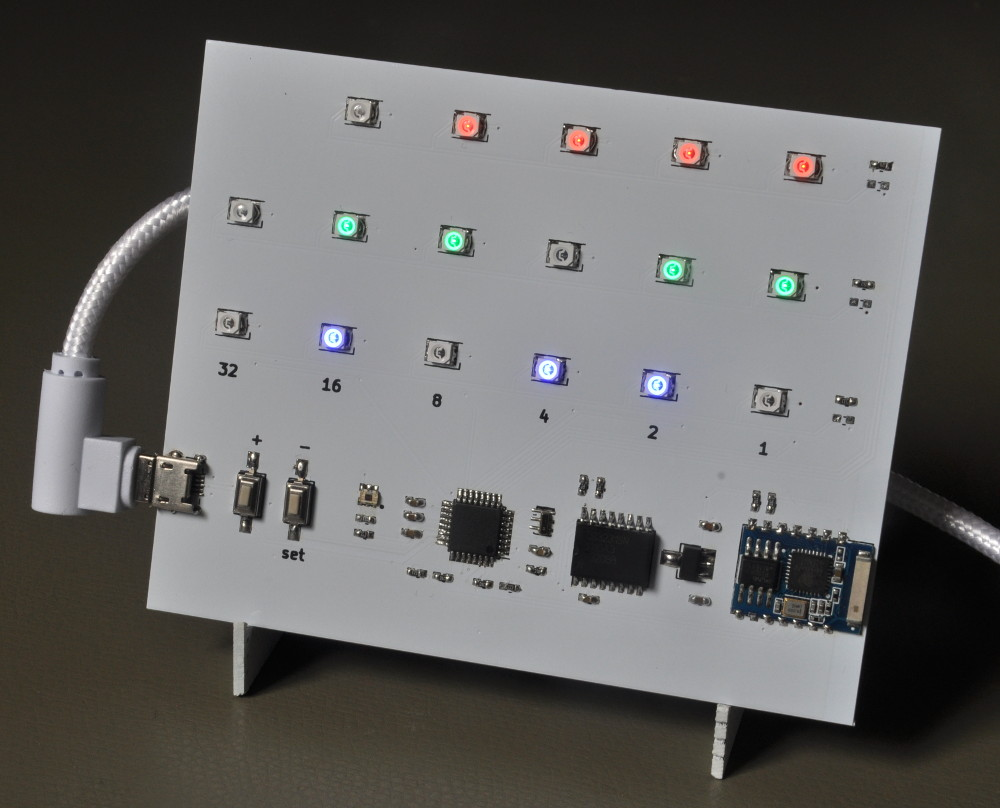

# Binary Clock
This project is about an Arduino/Genuino compatible binary clock.

## Main features:
 * Programmable via Arduino IDE and simple USB-cable (hardware compatible with Arduino Nano)
 * Adaption of brightness to ambient brightness
 * Ultra dark night mode for sleeping in dark rooms
 * Adjustment of daylight saving time automatically
 * High precision of time
 * Time keeping with backup battery
 * Time synchronization per WLAN
 * Command line mode via serial console

## Features that turn clock into gadget:
 * Display Effect Modes (blink, flicker, heartbeat)
 * Command for display arbitrary numbers in binary format
 * WLAN module allows IOT operating mode (see [Interfaces](Interfaces.md) for more details)
 

